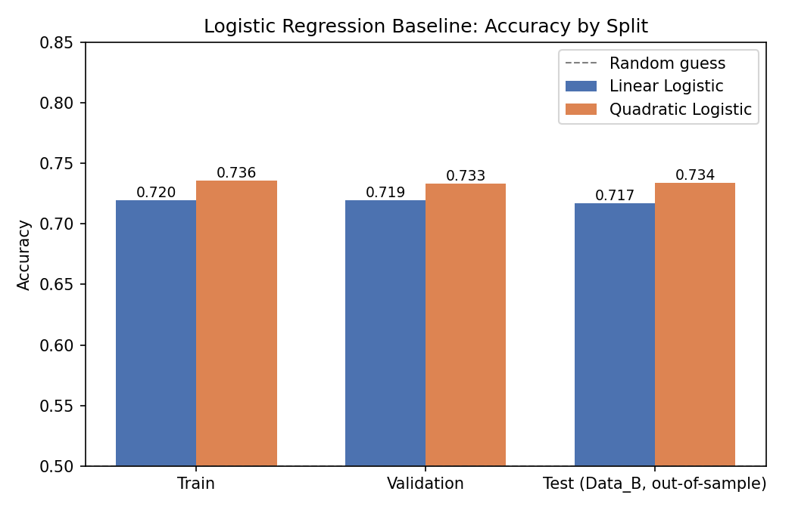
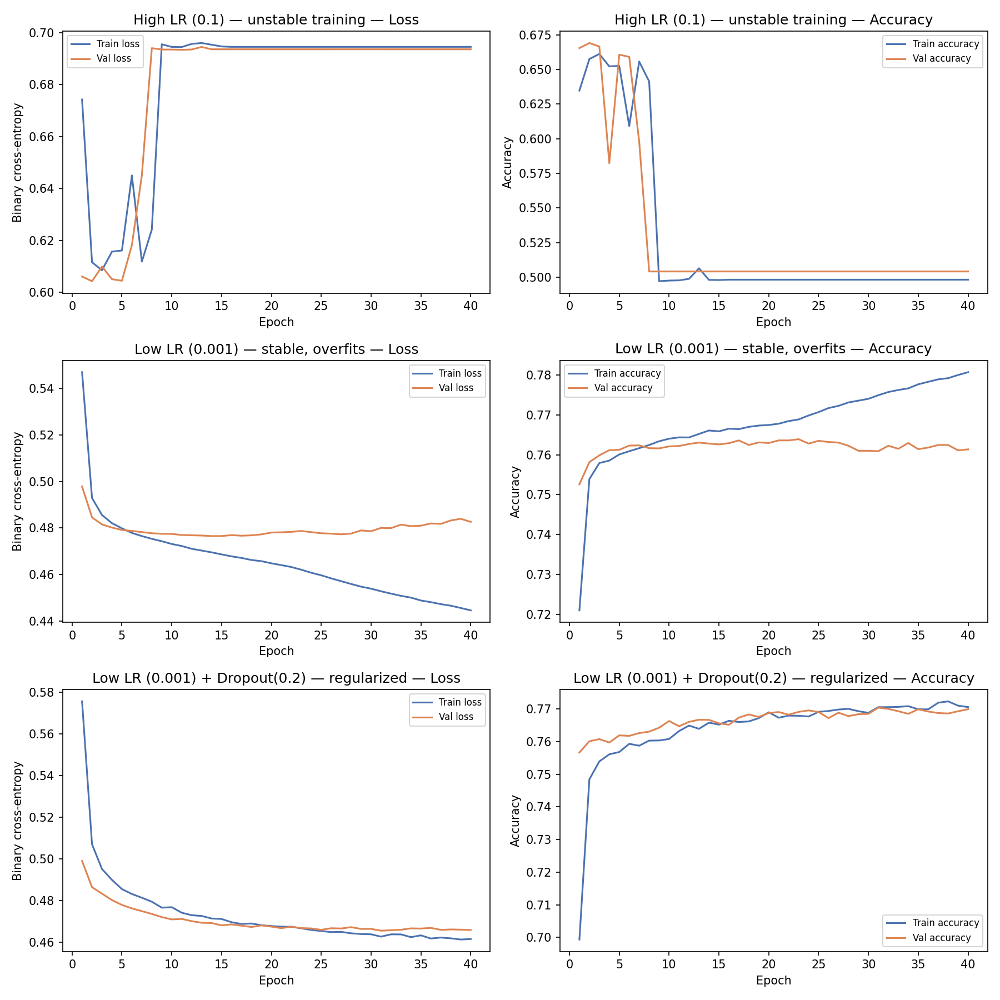
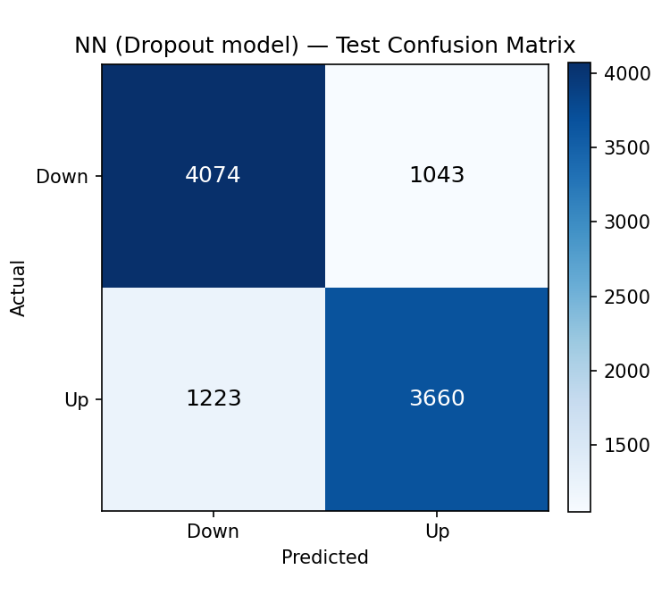
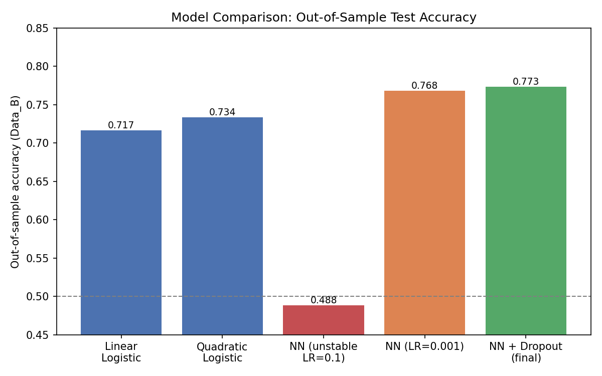

# Order Book Predictor — Neural Order Flow Forecasting

Predicting short-term mid-price direction (up/down) from limit order book (LOB) snapshots, comparing a **feed-forward neural network** against a **logistic regression baseline**.

This repository contains two Jupyter notebooks:

- [`notebooks/Limit_Order_Book_Classification_Logistic.ipynb`](notebooks/Limit_Order_Book_Classification_Logistic.ipynb) — linear and quadratic logistic regression baseline.
- [`notebooks/Limit_Order_Book_Classification_DL.ipynb`](notebooks/Limit_Order_Book_Classification_DL.ipynb) — a Keras/TensorFlow neural network, with an explicit walkthrough of learning-rate tuning and dropout regularization.

Both notebooks were re-run end-to-end for this write-up (see [Reproducing these results](#reproducing-these-results)), and all numbers and plots below come from that run — nothing here is copied from documentation or invented.

---

## 1. Problem

Given a snapshot of the limit order book — the best few price levels and resting volumes on the bid and ask side, plus a short history of recent price moves — predict whether the **mid-price will tick up or down next**. This is a binary classification problem over market microstructure features, the kind of short-horizon order-flow signal used as a building block in market-making and short-term execution strategies.

### Data actually used

- **`data/Data_A.csv`** — 100,000 samples, used for training (80,000 rows) and validation (20,000 rows).
- **`data/Data_B.csv`** — 10,000 samples, held out entirely for out-of-sample testing.
- **22 columns per row:**
  - Column 1: label — mid-price direction (0 = down, 1 = up).
  - Columns 2–17: price and volume at **4 levels** of the book on both bid and ask sides (`askl1..4`, `vola1..4`, `bidl1..4`, `volb1..4`).
  - Columns 18–22: the previous **5 mid-price change directions** (`m1..m5`), i.e. short lagged order-flow history.
- Classes are close to balanced: **50.27% "up" / 49.73% "down"** in Data_A, so accuracy is a meaningful metric here (a trivial always-predict-majority classifier would score ~50%).
- Each row is presented as an **independent sample** (not a raw sequential tick stream), so the model is a snapshot classifier over LOB + short-order-flow-history features rather than a sequence model (RNN/Transformer) unrolled over a tick stream.

---

## 2. Methodology

### Feature engineering
- Raw features are the 4-level bid/ask price & volume ladder plus the 5-step lagged direction history described above — a standard, if fairly shallow, hand-built market-microstructure feature set.
- **Z-score normalization**: means and standard deviations are computed **only on the training split** and then applied to validation and test data, avoiding lookahead/leakage from the held-out sets.
- Train/validation split is a simple positional split (first 80,000 rows train, remaining 20,000 validation) — the data is described as i.i.d. samples rather than a chronological stream, so no explicit time-based purging was needed beyond keeping `Data_B.csv` fully held out.

### Baseline: Logistic Regression
Two `scikit-learn` logistic regression variants, both `LogisticRegression` on the normalized features:
1. **Linear** — plain logistic regression on the 21 raw (normalized) features.
2. **Quadratic** — `PolynomialFeatures(degree=2)` (squares + pairwise interactions) fed into a `newton-cg`-solved logistic regression, to capture simple non-linear structure without a neural net.

### Neural Network
A small fully-connected Keras/TensorFlow network:

```
Input (21 features)
 → Dense(100, relu)
 → [Dropout(0.2)]        # regularized variant only
 → Dense(200, relu)
 → [Dropout(0.2)]        # regularized variant only
 → Dense(1, sigmoid)
```

Trained with the Adam optimizer and binary cross-entropy loss, batch size 128, 40 epochs. The notebook (and this reproduction) deliberately walks through three configurations to illustrate a real tuning process rather than presenting only the final model:

1. **High learning rate (0.1)** — to show what unstable training looks like.
2. **Low learning rate (0.001)** — stable training, but the train/validation gap widens (overfitting).
3. **Low learning rate + Dropout(0.2)** — the final, regularized model.

---

## 3. Results

All metrics below are from a fresh run against the included `Data_A.csv` / `Data_B.csv` on this machine (CPU only, no GPU used). `Data_B.csv` is the true out-of-sample test set — never touched during training, validation, or normalization-statistic computation.

### Baseline (logistic regression)

| Model | Train acc. | Val acc. | Test acc. (Data_B) | Test F1 |
|---|---|---|---|---|
| Linear logistic | 0.7196 | 0.7194 | **0.7169** | 0.7128 |
| Quadratic (degree-2) logistic | 0.7356 | 0.7335 | **0.7337** | 0.7293 |



### Neural network

| Configuration | Train acc. | Val acc. | Test acc. (Data_B) | Test F1 |
|---|---|---|---|---|
| LR = 0.1 (unstable) | 0.5023 | 0.5042 | 0.4883 | 0.6562 |
| LR = 0.001 | 0.7809 | 0.7614 | 0.7685 | 0.7682 |
| LR = 0.001 + Dropout(0.2) (final) | 0.7792 | 0.7699 | **0.7734** | 0.7636 |

The LR = 0.1 run is a genuine training failure, not a typo: the high learning rate pushes the sigmoid output to collapse to predicting a single class for almost the whole run (precision = accuracy, recall = 1.0), which is exactly the instability the notebook is designed to demonstrate before fixing it by lowering the learning rate.



The curves show the intended story: the LR=0.1 run diverges early and flatlines at ~50% (coin-flip) accuracy; the LR=0.001 run trains smoothly but its train accuracy keeps climbing past validation (classic overfitting, ~2 pt train/val gap by epoch 40); adding Dropout(0.2) closes most of that gap, with train and validation curves tracking closely through epoch 40.

**Confusion matrix, final NN model, on the held-out test set (10,000 rows):**



### Head-to-head: baseline vs. neural network



The regularized neural network reaches **77.3% out-of-sample accuracy** versus **71.7%** for plain linear logistic regression and **73.4%** for the quadratic logistic regression — a **~4-6 point improvement** from allowing the model to learn non-linear interactions between LOB levels and recent order-flow history, beyond what a hand-specified degree-2 polynomial expansion captures. This matches the conclusion drawn in the original notebook (which reported 0.7733 for its dropout model on the same test split — this independent re-run reproduced 0.7734, a difference attributable only to floating-point/library-version noise).

All raw metrics (including precision/recall and the full confusion matrix) are saved as JSON in [`results/logistic_metrics.json`](results/logistic_metrics.json) and [`results/dl_metrics.json`](results/dl_metrics.json).

---

## 4. Reproducing these results

```bash
pip install numpy pandas matplotlib scikit-learn tensorflow
```

Then either open the two notebooks in `notebooks/` and run all cells, or run the equivalent standalone scripts against `data/Data_A.csv` / `data/Data_B.csv` (normalize on train statistics only, then fit/evaluate as described above). Training the neural network for all three configurations (40 epochs each) took **~3.5 minutes total on a 4-core CPU** — no GPU is required to reproduce these numbers.

### Environment note (be aware before you try)
The committed `requirements.txt` in this repo is a full `pip freeze` from the author's Windows environment, saved with **UTF-16 encoding** — `pip install -r requirements.txt` will fail against it as-is on most systems (it needs to be re-saved as UTF-8, or you can just install the short list of core packages above). Separately, on the machine used for this write-up, the pre-existing global `scipy`/`scikit-learn` install was version-mismatched (`scipy==1.7.3` next to `numpy==1.26.4`, which breaks `sklearn` imports); this was worked around with an isolated virtual environment rather than modifying any system-wide packages.

---

## Author

**Pablo López Serna**
Physics graduate, currently completing a Master's in Financial Engineering.
📍 Salamanca, Spain
[LinkedIn](https://www.linkedin.com/in/pablolopse) · [GitHub](https://github.com/pablolopse)
